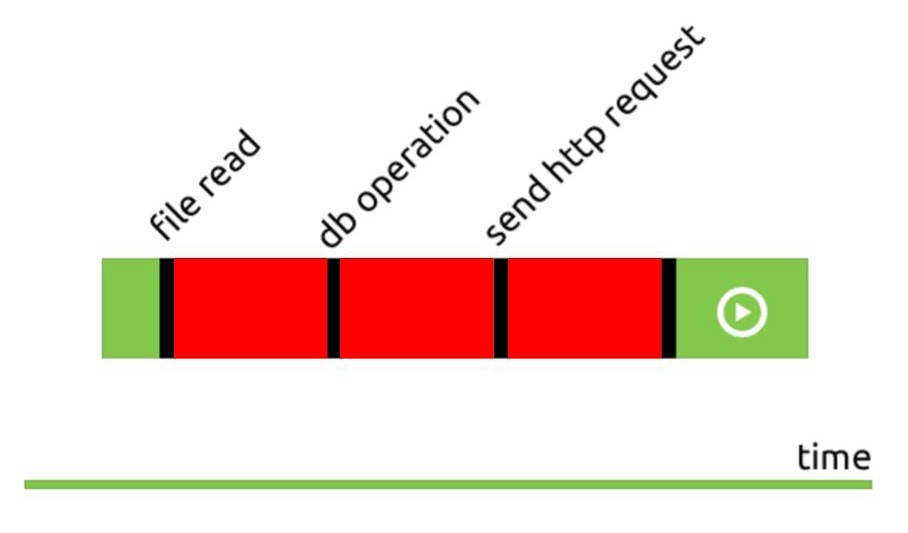

# Lesson 1. Node js вступление

- Node.js. NPM
- Базовые модули Node.js
- Работа с файловой системой. модуль fs
- Прямой доступ к файлам. переменная path
- Создание Web-сервера на Node.js
- Организация кода в Node.js
- Nodemon, мониторинг изменений в файлах Node.js
- Роутинг

## NPM

`npm` это пакетный менеджер, который работает на node js.

С помощью npm можно устанавливать пакеты (библиотеки) локально или глобально. В локальном режиме пакеты устанавливаются в каталог node_modules родительского каталога.

Пакеты можно ставить локально `npm install <package-name>` и глобально локально `npm install <package-name> -g`

[Введение в пакетный менеджер](http://prgssr.ru/development/vvedenie-v-paketnyj-menedzher-npm-dlya-nachinayushih.html)

## Базовые модули Node.js

### Подключение скриптов: require

В браузере, когда мы хотим добавить еще один скрипт на страницу мы используем, как правило тег: <script></script>. В Node.JS для этой же цели мы используем специальную команду: «require» и работает она совсем, совсем по другому.

#### Пример

Файл 1

```
const module = {
    app: 'myApp'
};

module.exports = module

```

Файл 2

```
cosnt myModule = require('./module');

console.log(myModule);
```

### Переменная «global»

Что если мы хотим все таки глобальные переменные? Например есть такие объекты как скажем «logger» или «База данных» или какой то глобальный объект приложения, которые мы хотим, чтобы были доступны явно и везде. Без всяких там экспортов, просто потому что они, такие вот важные. На самом деле в Node.JS есть концепция глобальных переменных, но вместо объекта «window», который используется в браузере, используется объект «global». И то, что мы пишем в этот объект «global». Работает он так же как и window в браузере.

### Http модуль

В node js есть модуль HTTP. Он позволяет передавать данные по http протоколу, создавать серверы, получать запросы, отправлять ответы и записывать информацию в них.

Модуль http крайне низкоуровневый: создание сложного веб-приложения с использованием вышеприведенного фрагмента кода очень трудоемко. Именно по этой причине мы обычно выбираем фреймворки для работы над нашими проектами. Есть множество фреймворков, вот самые популярные:

- [express](https://expressjs.com/)
- [hapi](https://hapijs.com/)
- [koa](https://koajs.com/)
- [restify](http://restify.com/)

Пример

```
const server = http.createServer(requestHandler)
```

### FS (file system) модуль

В Node.JS, для работы с файлами существует модуль «FS» и в нем есть множество функций для самых различных операций с файлами и директориями.

#### Базовые операции

- Read files
- Create files
- Update files
- Delete files
- Rename files

[Ссылка на документацию](https://js-node.ru/site/article?id=23)

Есть одинаковые методы как `fs.copyFile()` и `fs.copyFileSync()`

Первое просто имя, второе со словом Sync. Слово Sync означает синхронно.Если я например вызову fs.readFile(file[, options], callback), то он сначала прочитает файл полностью, а потом вызовет callback. А fs.readFileSync(file[, options]) затормозит выполнение процесса пока файл не будет прочитан. По этому, как правило синхронный вызов используют либо в консольных утилитах, либо на стадии инициализации сервера, когда такие тормоза допустимы. А асинхронный вызов, в тех случаях когда хочется, чтоб полноценно работал событийный цикл, то есть, чтоб Node.JS не ждал пока диск сработает, медленно и файл прочитается.

[Ссылка на статью с примерами](https://www.w3schools.com/nodejs/nodejs_filesystem.asp)

## Работа с файлами

Модуль FileSystem отвечает за работу с файлами. Инициализация модуля происходит следующим образом:

```
const fs = require('fs');
```

**fs.exists(path, callback)** - проверка существования файла.
**fs.readFile(@lename, [options], callback)**- чтение файла целиком
**fs.writeFile(filename, data, [options], callback)**- запись файла целиком
**fs.appendFile(filename, data, [options], callback)**- добавление в файл
**fs.rename(oldPath, newPath, callback)** - переименование файла.
**fs.unlink(path, callback)** - удаление файла.

Функции **callback** принимают как минимум один параметр err, который равен null при успешном выполнении команды или содержит информацию об ошибке. Помимо этого при вызове readFile передается параметр data, который содержит уже упоминавшийся объект типа Buffer, содержащий последовательность прочитанных байтов. Чтобы работать с ним как со строкой, нужно его конвертировать методом toString().

```
fs.readFile('readme.txt', function (err, data) { if (err) { throw err;}
console.log(data.toString()); });
```

Также почти все методы модули fs имеют синхронные версии функции, оканчивающиеся на Sync. Этим функциям не нужны callback, т.к. они являются блокирующими и поэтому рекомендованы к применению, только если это требует текущая задача. Давайте напишем программу, которая будет читать каталог и выводить его содержимое, а для файлов выводить их размер и дату последнего изменения.

```
const fs = require('fs'),
path = require('path'),
dir = process.cwd(),
files = fs.readdirSync(dir);
console.log('Name \t Size \t Date \n');
files.forEach(function (@lename) {
let fullname = path.join(dir, @lename),
stats = fs.statSync(fullname);
if (stats.isDirectory()) {
console.log(@lename + '\t DIR \t' + stats.mtime + '\n');
} else {
console.log(@lename + '\t' + stats.size + '\t' + stats. mtime + '\n');
} });
```

Давайте разберем эту программу подробно. В начале мы подключаем два стандартных модуля:

```
const fs = require('fs'), path = require('path')
```

Первый отвечает за запись и чтения файлов, а модуль path за работу с путями файлов. В переменную dir мы с помощью метода process.cdw() сохраняем текущую директорию и тут же в переменную files считываем синхронном режиме fs.readdirSync(dir) все файлы из текущего каталога. В синхронном потому, что нам надо получить весь список файлов и поддиректорий из текущей директории, прежде чем приступить к ее анализу. Выводим шапку нашей будущей таблички:

```
console.log('Name \t Size \t Date \n');
```

И потом методом forEach по массиву files, прочитанных элементов директории, проходимся и выводим в консоль информацию об элементах. Через метод path.join соединяем пути к файлу, и в переменную stats записываем информацию о текущем файле. Мы выводим stats.mtime — время создания файла и stats.size для определения размера файла. С помощью stats.isDirectory() определяем является ли элемент директорией и если да, для него не выводим размер, а ключевое слово DIR.

### path модуль

Модуль path предоставляет утилиты для работы с путями к файлам и директориям.
С помощью нее мы можем взять файл который нам нужен и передав его в другой модуль (например fs) сделать нужные операции.

Пример:

```
path.join('/foo', 'bar', 'baz/asdf', 'quux', '..')
// Возвращает: '/foo/bar/baz/asdf'

path.resolve('wwwroot', 'static_files/png/', '../gif/image.gif')
// если текущая рабочая директория /home/myself/node,
// Возвращает '/home/myself/node/wwwroot/static_files/gif/image.gif'

```

[Все методы модуля](https://js-node.ru/site/article?id=30)

#### Ключевое слово \_\_dirname

В Node.js, `__dirname` всегда находится каталог, в котором находится текущий исполняемый script. Поэтому, если вы набрали `__dirname` в `/d1/d2/myscript.js`, значение будет `/d1/d2`.

# Node js потоки

- Синхронность, асинхронность процессов
  - синхронные асинхронные методы
  - event loop
  - promise object
  - async, await
- Потоки в node js

## Синхронность, асинхронность процессов

В традиционной практике программирования большинство операций ввода-вывода происходит синхронно.

Что происходит в фоновом режиме? Основной поток будет заблокирован до тех пор, пока файл не будет прочитан, а это означает, что за это время ничего другого не может быть сделано. Чтобы решить эту проблему и лучше использовать ваш CPU, вам придется управлять потоками вручную.

Если у вас больше блокирующих операций, очередь событий становится ещё хуже:



Красные полосы отображают промежутки времени, в которые процесс ожидает ответа от внешнего ресурса и блокируется, чёрные полосы показывают, когда ваш код работает, зелёные полосы отображают остальную часть приложения

Для решения этой проблемы Node.js предлагает модель асинхронного программирования.

[Асинхронное програмирование в node js](https://medium.com/devschacht/node-hero-chapter-3-cae7333c7f3d)

## Event loop

Цикл событий (Event Loop) — это то, что позволяет Node.js выполнять неблокирующие операции ввода/вывода (несмотря на то, что JavaScript является однопоточным) путем выгрузки операций в ядро системы, когда это возможно.

[Лучшее видео об event loop](https://www.youtube.com/watch?v=8cV4ZvHXQL4)

[Ссылка на презентацию по event loop](https://drive.google.com/open?id=1OBMSG1HyNa13DtI_J_csFMvk0O6S9pQK)

### Promise

В JavaScript «промисы» представляет собой конечный результат выполнения асинхронной операции. Их можно рассматривать в качестве своеобразного «заполнителя». Такой «заполнитель», по существу, является объектом, к которому мы можем привязать функции обратного вызова (колбэки).

Всего существует 3 возможных состояния для промисов:

- Pending (ожидание) означает, что асинхронная операция выполняется;
- Fulfilled (успешное выполнение) означает, что операция была выполнена успешно, а промисам было присвоено определенное значение;
- Rejected (выполнено с ошибкой) означает, что во время выполнения операции произошла ошибка.

В том случае если состояние промиса не находится в ожидании обработки (pending), то промис считается выполненным, при чем выполненным окончательно: его состояние не может меняться.

[Статья по промисам 1](https://habr.com/company/zerotech/blog/317256/)
[Статья по промисам 2](https://blog.liveedu.tv/javascript-promises/)

#### Видео по промисам

- https://www.youtube.com/watch?v=SjNmkeUpQAU
- https://www.youtube.com/watch?v=s6SH72uAn3Q

## Создание Web-сервера на Node.js

Вот пример создания простого сервера на nod.js

```
const http = require('http');
const port = 3000;

const requestHandler = (request, response) => {
    console.log(request.url);
    response.end('Hello Node.js Server!');
};

const server = http.createServer(requestHandler);

server.listen(port, (err) => {
    if (err) {
        return console.log('something bad happened', err)
    }
    console.log(`server is listening on ${port}`)
});

```

Теперь мы можем отправить запрос на адрес `http://localhost:3000/` и получить ответ от сервера.

[Пример простого сервера и клиента с POST запросом](https://gist.github.com/umidjons/88fa0041e6dd583491dd83662d007d2c)

## Простой сайт на Node.js

Веб-сервер на Node.js состоит из нескольких строчек кода:

```
let http = require('http'); http.createServer(function(req, res) {
console.log('HTTP server running on port 8080'); }).listen(8080);
```

Что здесь происходит? Это легко понять. Сначала мы запрашиваем модуль 'http', затем создаем сервер http.createServer и запускаем его listen на порту 8080. Метод createServer объекта http принимает в качестве аргумента анонимную функцию обратного вызова, аргументами которой, в свою очередь служат объекты req– request и res – response. Они соответствуют поступавшему HTTP-запросу и отдаваемому HTTP-ответу. Если мы запустим в консоли наш скрипт server.js и потом в браузере обратимся по адресу http://localhost:8080/ , то в консоли будет следующее:

```
HTTP server running on port 8080
```

Но в самом браузере мы ничего пока не увидим. Остановим выполнение скрипта комбинацией Ctrl+C и допишем следующий код:

```
const http = require('http'); http.createServer(function(req, res) {
console.log('HTTP server running');
res.writeHead(200, {'Content-Type': 'text/html'});
res.end('<h1>Hello student!</h1>');
}).listen(8080);
```

Запустим опять скрипт и в браузере по адресу [http://localhost:8080/](http://localhost:3000/) мы наконец-то увидим результат.

Как мы видим, HTTP-запрос не является инициатором запуска всей программы. Создается Javascript-объект и ждет запросы, при поступлении которых срабатывает связанная с этим событием анонимная функция.
В принципе неплохо, но мы уже работали с файлами и давайте заставим сервер отдавать нам страницу HTML.
Создадим простую веб-страницу:

```
<!DOCTYPE html>
<html lang="en"> <head>
<meta charset="UTF-8">
<title>GoIt</title> <style>
h1 {color: blue;}
h1:hover { color: #ccc;} </style>
</head>
<body>
<h1>My first page</h1>
</body>
</html>
```

Модифицируем серверный скрипт:

```
const http = require('http'),
	   fs = require('fs');
http.createServer(function (req, res) {
fs.readFile('index.html', 'utf8', function (err, data) {
if (err) {
res.writeHead(404, { 'Content-Type': 'text/html'});
res.end('Erorr load index.html');
}
else {
res.writeHead(200, { 'Content-Type': 'text/html' });
res.end(data);
}
})
}).listen(8080);
console.log('HTTP server running on port 8080');
```

Выполним в консоли команду **node server.js** и увидим в браузере нашу html страничку.

## Сетевые запросы

Стандартный модуль http содержит функцию get для отправки GET запросов и функцию request для отправки POST и прочих запросов.

Пример отправки GET запроса:

```
const http = require('https');
http.get("https://www.google.com/", function(res) {
console.log("Статус Статус отвеrтeа:" StatusCode);
}).on('error',function(e){ console.log("Статус ошибки:" message);
});
```

Пример отправки POST запроса:

```
const http = require('http');
const options = {
hostname: 'google.com',
port: 80,
path: '/',
method: 'POST' };

const req = http.request(options, function (res) {
console.log('STATUS: ' + res.statusCode);
console.log('HEADERS: ' + JSON.stringify(res.headers));
res.setEncoding('utf8');
res.on('data', function (chunk) {
console.log('BODY: ' + chunk);
});
});
req.on('error', function (e) {
console.log('Возникла проблема Возникла проблема с ответом от сервера: ' message});
req.write('data\n');
req.end();
```

В основном используют популярный и удобный npm-модуль для работы с исходящими сетевыми запросами — request .

Пример отправки GET запроса:

```
const request = require('request');
request('https://www.google.com/', function (err, res, body) {
if (!err && res.statusCode == 200) {
console.log(body)
}
});
```

Мы напечатаем в консоль заглавную страницу.

Пример отправки POST запроса:

```
var request = require('request');
request({
method: 'POST',
uri: 'https://www.google.com/', form: {
key: 'value' },
},
function (err, res, body) {
if (err) {
console.error(err); }
else {
console.log(body);
console.log(res.statusCode); }
});
```

Это модуль полезен тем, что позволят автоматически обрабатывать JSON, работать с учетом редиректов или без них, поддерживает BasicAuth и OAuth, проксиз и, наконец, поддерживает cookies.

### Задачи, которые должен реализовывать сервер.

Для создания онлайн веб-приложение нам нужен HTTP-сервер;

- Нашему серверу необходимо обслуживать различные запросы в зависимости от URL, по которому был сделан запрос. Для этого нам нужен какой-нибудь роутер (маршрутизатор) - он у нас уже есть в React, чтобы иметь возможность направлять запросы определенным обработчикам;
- Для выполнения запросов, пришедших на сервер и направляемые роутером, нам нужны действующие обработчики запросов;

- Роутер, вероятно, должен иметь дело с разными входящими POST-данными и передавать их обработчикам запросов в удобной форме. Для этого нам нужен какой-нибудь обработчик входных данных;

- Мы хотим не только обрабатывать запросы, но и показывать пользователю контент по запрошенным URL-адресам, поэтому нам нужна некая логика отображения для обработчиков запросов, чтобы иметь возможность отправлять контент пользовательскому браузеру;

- Последнее, но не менее важное — пользователь может загружать данные, поэтому нам нужен какой-нибудь обработчик загрузки, который возьмёт на себя заботу о деталях.

## Организация кода в Node.js

#### 5 основных правил структурирования проектов

Существует множество возможных способов организации Node.js-проектов и каждый из известных методов имеет свои плюсы и минусы. Однако разработчики всегда хотят добиться одного и того же: чистоты кода и возможности легко добавлять новые функции.

[5 основных правил структурирования проектов](https://medium.com/devschacht/node-hero-chapter-7-4078fa61ece6)

[Node.js app пример](https://github.com/contentful/the-example-app.nodejs) смотрите только те файлы и папки что вам нужны

## Nodemon, мониторинг изменений в файлах Node.js

Абсолютно у всех разработчиков знакомство с nodejs начинается с того, что после каждого изменения нужно перезагружать сервер. Поэтому, в этом видео мы разберем, как сделать так, чтобы сервер перегружался автоматически.

Самый популярный вариант - это nodemon. То есть идея состоит в том, что в development окружении мы хотим, чтобы nodemon следил за файлами, которые мы меняем и просто перезапускал сервер, если эти файлы относятся к серверу.

Для установки - `npm install -g nodemon`

[Видео по nodemon](https://monsterlessons.com/project/lessons/perezagruzhaem-node-s-pomoshyu-nodemon)
