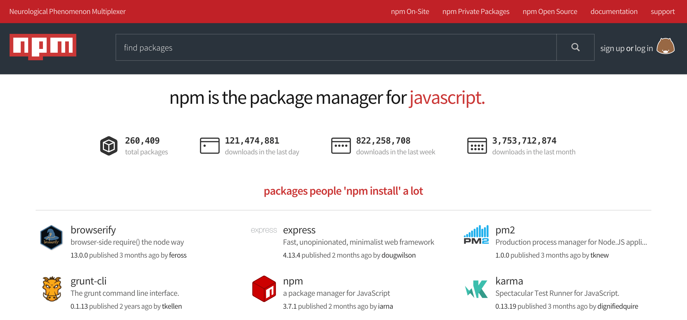

# Файлы ввода/вывода с node.js

К счастью, Node.js сильно облегчает обработку содержания файла с помощью встроенного модуля filesystem (fs). Модуль fs имеет функцию readFile, которая берёт путь к файлу и обратный вызов. Обратный вызов будет исполнен, когда файл будет полностью прочитан. Данные файла попадают в форме типа Buffer, что является набором битов.

```javascript
//hello.js
const fs = require("fs");

fs.readFile("hello.txt", "utf8", (error, content) =>
  content
    .split("\n")
    .filter(line => line.includes("dog"))
    .forEach(line => console.log(line))
);
```

```
//hello.txt

fluffykins is a dragon
wolfbane is a dragon
kittylunch is a cat
karo is a dog
multidog is a dog
```

# Использование NPM

Каждый проект Node.js начинается с создания файла package.json. Вы можете думать о нем как о JSON-представлении приложения и его зависимостей. Он содержит имя вашего приложения, автора (вас) и все зависимости, необходимые для запуска приложения.

## NPM в двух словах

NPM — это менеджер пакетов, используемый Node.js-приложениями. В нём вы можете найти массу готовых модулей, поэтому вам не нужно изобретать колесо. Это похоже на Maven для Java или Composer для PHP. Существует два основных интерфейса, с которыми вы будете взаимодействовать: сайт NPM и набор инструментов командной строки (CLI).

И веб-сайт, и CLI используют один и тот же реестр, чтобы искать и отображать модули.

## Вебсайт

Сайт NPM можно найти по адресу [https://npmjs.com](https://npmjs.com). Здесь вы можете зарегистрироваться как новый пользователь или поискать нужные пакеты.



## Интерфейс командной строки

Чтобы запустить CLI, достаточно написать:

```
npm
```

Обратите внимание, что NPM поставляется вместе с бинарным файлом Node.js, поэтому вам не нужно его устанавливать, однако если вы хотите использовать определенную версию NPM, вы можете его обновить. Если вы хотите установить NPM версии 6, вы можете сделать это с помощью: `npm i npm@ -g`.

## Использование NPM: Учебное пособие

Вы уже встречались с NPM в [предыдущей главе](https://medium.com/devschacht/node-hero-chapter-1-239f7afeb1d1), когда создавали файл `package.json`. Давайте расширим наши знания!

## Добавление зависимостей

**В этом разделе вы узнаете, как добавлять рантайм зависимости к вашему приложению.**

В процессе разработки может потребоваться необходимость внести изменения в уже запущенный проект.

В этом случае необходимо перезапустить сервер. Однако это не очень удобно, особенно когда необходимо часто делать различные изменения, тестировать выполнение. И в этом случае нам может помочь специальный инструмент nodemon.

Установим nodemon в проект с помощью следующей команды:

```
npm i -g nodemon
```

Флаг -g представляет сокращение от global и позволяет установить зависимость nodemon глобально для всех проектов на данной локальной машине.

После установки запускаем наш файл с помощью следующей команды:

```
nodemon app.js //(тут написать название файла, который надо запустить и отслеживать)
```

Теперь при внесении изменений сервер автоматически будет перезапущен.

---

Часть зависимостей необходимо добавлять только к вашему приложению. Когда у вас есть файл `package.json`, вы можете добавить зависимости к вашему приложению. Давайте добавим одну! Попробуйте следующее:

```
npm i lodash
```

С помощью этой единственной команды мы достигли двух вещей: во-первых, `lodash` загружен и помещён в папку `node_modules`. Это папка, в которой будут находиться все ваши внешние зависимости. Обычно вы не хотите добавлять её в свою систему управления версиями, поэтому, если вы используете git, обязательно добавьте `node_modules` в файл `.gitignore`.

---

Давайте посмотрим, что происходит в файле `package.json`! Появилось новое свойство, называемое `dependencies`:

```javascript
"dependencies": {
  "lodash": "4.17.1"
}
```

Это означает, что `lodash` версии `4.17.1` теперь установлен и готов к использованию. Обратите внимание, что NPM следует правилам SemVer для версионирования пакетов.

> _Используя нумерацию версий вида MAJOR.MINOR.PATCH, повышайте MAJOR-версию, когда вы делаете несовместимые изменения API, MINOR-версию, когда вы добавляете функциональность обратно-совместимым образом, и PATCH-версию, когда вы делаете исправления ошибок с обратной совместимостью. Для получения дополнительной информации: [http://semver.org/](http://semver.org/)_

Поскольку `lodash` готов к использованию, давайте посмотрим, как мы можем им воспользоваться! Вы можете сделать это так же, как и с вашим собственным модулем, но теперь вам не нужно указывать полный путь, достаточно только имени модуля, что бы его подключить через require('lodash'):

```javascript
// index.js
const _ = require("lodash");
```

## Добавление зависимостей для разработки

**В этом разделе вы узнаете, как добавлять зависимости, необходимые только во время сборки приложения.**

Когда вы собираете веб-приложения, вам может потребоваться минимизировать ваши JavaScript-файлы, объединить CSS-файлы и так далее. Модули, которые это сделают, будут выполняться только во время создания ресурсов, поэтому работающее приложение не нуждается в них.

Вы можете установить такие скрипты с помощью:

```javascript
npm i mocha --save-dev
```

После этого в вашем файле `package.json` появится новый раздел, называемый `devDependencies`. Все модули, которые вы устанавливаете с помощью `--save-dev`, будут описаны там, а также они будут помещены в тот же самый каталог `node_modules`.

## NPM-скрипты

NPM-скрипты — очень мощная концепция, с их помощью вы можете создавать небольшие утилиты или даже описывать сложные системы сборки.

Наиболее распространенными являются скрипты `start` и `test`. С помощью `start` вы можете описать, как нужно запускать приложение, а `test` используется для запуска тестов. В вашем `package.json` они могут выглядеть примерно так:

```javascript
"scripts": {
  "start": "node index.js",
  "test": "mocha test",
  "your-custom-script": "echo npm"
}
```

**Что следует здесь отметить:**

- `start`: просто описывает начальную точку для запуска вашего приложения, этот скрипт можно вызвать с помощью `npm start`.
- `test`: цель этого скрипта заключается в том, чтобы запускать ваши тесты: одно из удобств такого запуска тестов заключается в том, что в этом случае `mocha` не нужно устанавливать глобально, так как NPM будет искать её в папке `node_modules/.bin`, а `mocha` будет размещена там же. Запуск тестов может быть вызван с помощью `npm test`.
- `your-custom-script`: всё, что вы захотите (вы можете выбрать любое имя). Его можно вызвать с помощью `npm run your-custom-script` — не забывайте про `run` в этом случае!

## Ограничение области видимости и приватные пакеты

Первоначально у NPM было глобальное пространство имен для названий модулей, и с более чем 250 000 модулями в реестре большинство простых имен уже заняты. Кроме того, глобальное пространство имен содержит только общедоступные модули.

В NPM урегулировали эту проблему внедрением пакетов с ограниченной областью видимости (_scoped packages_), они имеют следующий шаблон именования:

```
@myorg/mypackage
```

Вы можете устанавливать пакеты с ограниченной областью видимости так же, как и раньше:

```
npm install @myorg/mypackage --save-dev
```

Они будут отображаться в вашем `package.json` следующим образом:

```javascript
"dependencies": {
  "@myorg/mypackage": "^1.0.0"
}
```

Подключение пакетов с ограниченной областью видимости:

```javascript
require("@myorg/mypackage");
```

_Для получения большей информации обратитесь к [документации NPM-модулей с ограниченной областью видимости](https://docs.npmjs.com/misc/scope)._

---

# Разбираемся с версиями пакетов в node

Итак когда мы устанавливаем какой-то пакет, например, express, то в package.json добавляется последняя версия пакета, состоящая из трех цифр. Эти цифры означают Major, Minor, Patch и используют как спецификацию semver.

Что это значит? Когда я делаю пакет и еще не опубликовал его, то первая цифра идет 0. Это значит, что какие бы номера версий не шли дальше, я могу в любом момент менять любой функционал пакета. Потому что пакет, начинающийся с 0 - нестабильный пакет.

Когда мы опубликовали пакет, то каждый номер версии начинает иметь смысл. Последняя цифра - это PATCH. То есть внесение незначительных изменений в пакет, например bugfix.

Средняя цифра - это минорная версия. Она должна обновляться при изменениях, которые добавляют новый функционал, но не ломают то, что уже работает. Таким образом любой человек может обновится с 1.2.0 на 1.3.0 и все должно по прежнему работать.

Первая же цифра - это мажорная версия. Если внеслись хоть какие-то изменения, которые сломали текущий код, то должна релизится новая мажорная версия. Это может быть как изменение API, так и изменение порядка аргументов. Поэтому нужно делать версию 2.0.0.

Собственно вся система версий и пакетов подчиняется спецификации semver, о которой вы можете почитать на сайте semver.org.

Теперь немного о дополнительных символах при версии пакета.

Мы можем указать, что пакет должен быть больше версии 1.2.7

> = 1.2.7
> Тогда, при установке пакетов версия будет искаться только среди версий, которые больше 1.2.7.

Также можно указывать range.

> =1.2.7 <1.3.0
> Также есть специальные пре релизные теги.

1.2.3-alpha.3
1.2.3-beta.0
Также часто встречаются тильда и каретка.

Когда у нас стоит тильда

~1.2.3
Это значит, что версия может меняться только от 1.2.3 до 1.3.0, то есть могут применятся только патчи, а минорная версия обновлятся не может.

Если же у нас стоит каретка

^1.2.3
То можно обновлять и минорную версию и накатывать патчи. То есть от 1.2.3 до 2.0.0.

---

# Разбираемся с lock файлами в npm

Что такое lock файлы вообще? В разных языках для установки пакетов существуют пакетные менеджеры. Например, в node - это npm. И когда мы устанавливаем пакеты, то мы должны быть уверены, что мы все время будем устанавливать одинаковую версию пакетов. Потому что любое, даже минорное обновление, может все поломать.

Очень много людей считает, что если в package.json указать точные версии пакетов, но они никогда не обновятся и проект в безопасности. Это абсолютно не так. В чем же проблема?

Да, указав версию пакета, например, в 1.5.0 мы всегда будем устанавливать этот пакет именно версии 1.5.0. Но у каждого пакета есть свои зависимости. И мы никогда не знаете, как он их менеджит. Возможно, он не лочит их на конкретной версии. А даже если и лочит, то зависимости зависимостей могут иметь не точные версии. Поэтому, рано или поздно, с большим количеством пакетов на проекте, при очередной установке пакетов все может поломаться и прийдется долго дебажить, почему.

Эту проблему решают с помощью lock файлов. Что это такое? Это дополнительный файл, который генерируется автоматически и хранит в себе полное дерево всех зависимостей с версиями. И после его генерации все пакеты устанавливаются по новой с версиями и зависимостями, которые там указаны.

По умолчанию в npm 5, которая на данным момент последняя, при установке пакетов у вас автоматически создается и обновляется файл package-lock.json. Вам не нужно ничего дополнительно делать. Вы просто должны закоммитить этот файл также, как и обычный файл проекта в репозиторий.

Если же вы используете yarn, вместо npm, то у вас также автоматически генерируется файл yarn.lock, который лочит все версии.

Если же вы все еще используете более старый npm, то lock файл у вас не будет создаваться руками. Для создания его нужно выполнить команду

```javascript
npm shrinkwrap
```

В результате у вас создастся файл npm-shrinkwrap.json, в котором будут залочены все зависимости.

Какой бы язык или пакетный менеджер вы не использовали, вы всегда должны использовать lock файлы, во избежание дебага обновившихся пакетов.

Также, я бы рекомендовал все всегда использовать точные версии в package.json. Тогда, если кто-то удалит lock файл, шанс, что при установке пакетов что-то отлетит все таки меньше.
