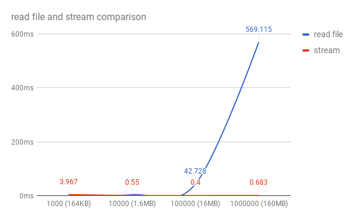

## Потоки в node js (Streams)

Поток — это концепция, которая была сначала реализована в UNIX системах для передачи данных из одной программы в другую в операциях ввода/вывода. Это позволяет каждой программе быть очень специализированной в том, что она делает — быть независимым модулем. Сочетание таких простых программ помогает в создании более сложных систем путем «объединения» их в цепочку вызовов.

Распространенная задача — парсинг файла большого объема. Например, в текстовом файле с данными логов нужно найти строку, содержащую определенный текст. Вместо того, чтобы файл полностью загрузить в память, и потом начать разбирать в нем строки в поисках нужной, мы можем его считывать небольшими порциями. Тем самым не занимаем память сверх необходимого, а лишь столько памяти, сколько нужно для буферизации считанных данных. Как только найдем требуемую запись, сразу прекратим дальнейшую работу. Или можем передать найденную запись в другой поток по цепочке, например, для преобразование в другой формат, или сохранения в другой файл.

Самое большое преимущество потоков по сравнению с одновременной загрузкой всех данных состоит в том, что входные данные могут быть бесконечными и без ограничений.

Как только поток открывается, данные передаются блоками (chunks) из своего источника в процесс, потребляющий их. Поступая из файла, каждый символ или байт считывается по одному.

Модуль stream предоставляет базовый API по работе с потоками в Node.JS. Документации Node.JS вполне достаточно, чтобы разобраться в данном вопросе, но мы попытаемся составить что-то вроде шпаргалки с пояснениями некоторых моментов.

### Виды потоков

#### Есть четыре вида потоков:

- **Readable** — поток, который предоставляет данные на чтение;
- **Writable** — поток, в который данные можно записывать;
- **Duplex** — поток, из которого можно как читать данные (Readable), так и записывать в него (Writable), при этом процесс чтения и записи просиходит независимо друго от друга;
- **Transform** — разновидность Duplex потоков, которые могут изменять данные при их записи и чтении в/из потока (чаще используется как промежуточное звено в цепочке передачи данных).

Видео для лучшего пониманию потоков

- https://www.youtube.com/watch?v=TobCwECU5Bs
- https://www.youtube.com/watch?v=GpGTYp_G9VE

## Readable stream

[Видео](https://www.youtube.com/watch?v=E3tTzx0Qoj0)

### `fs.readFile` vs `streams`

По умолчанию стандарт чтения текстовых файлов есть использование `fs.readFile(filename, “utf8")`

Преимущество в node.js для `createReadStream` заключается в том, чтобы читать файл в кусках по 16 Кбайт за раз. Как только мы прочитаем первый фрагмент, мы получим заголовок этой строки, а затем немедленно уничтожим поток, чтобы он больше не читал фрагменты. Это позволяет нам быстро работать независимо от размера файла.

И вот сравнение для чтения в CSV разных размеров, размером от 164 КБ до 160 МБ (ось х - это строки CSV / размер файла, ось у - это время, затраченное на соответствующую функцию read.js для чтения файлов):



Как вы можете видеть, `stream` метод остается в значительной степени плоским и быстрым, тогда как метод `readFile` начинает заметно возрастать, когда мы приближаемся к размеру файла размером ~ 16 МБ.

Если вы планируете иметь дело с текстовыми файлами большего размера, чем около 10 МБ, лучше всего не использовать `readFile` и вместо этого использовать потоки.

Есть еще одна вещь, чтобы упомянуть, использование потока кажется немного более быстрым при работе с файлом 100000+ строк по сравнению с меньшими размерами файлов.

[Статья](https://medium.com/tensult/stream-and-buffer-concepts-in-node-js-87d565e151a0)

### Writable stream

В поток на запись можно послать данные используя метод `stream.write`, но прочитать их уже не получится:

`src.pipe(writableStream)`

```
var fs = require("fs");
var data = 'Simply Easy Learning';

// Create a writable stream
var writerStream = fs.createWriteStream('output.txt');

// Write the data to stream with encoding to be utf8
writerStream.write(data,'UTF8');

// Mark the end of file
writerStream.end();

// Handle stream events --> finish, and error
writerStream.on('finish', function() {
    console.log("Write completed.");
});

writerStream.on('error', function(err){
   console.log(err.stack);
});

console.log("Program Ended");

```

[Видео по Writable stream](https://www.youtube.com/watch?v=DvlCT0N7yQI)

### Преобразование данных

Потоки хороши не только для передачи данных между различными источниками и адресатами.

Когда после открытия потока данные становятся доступны, разработчики могут преобразовывать данные, поступающие из потока, до того, как они достигнут своего адресата, например, преобразовывая все символы нижнего регистра в файле в символы верхнего регистра.

Это одна из величайших сил потоков. Как только поток открывается и вы можете прочитать данные по частям, вы можете вставить различные программы в промежутке. Этот процесс показан на рисунке ниже.

### Pipe метод

Любой поток может использовать.pipe() для соединения входов с выходами.

.pipe() это просто функция, которая берет поток на чтение src и соединяет его вывод с вводом потока на запись.

Чтобы передать данные из одного потока в другой, самый простой способ вызвать над потоками метод pipe:

```
Readable.pipe(Writable);//например, по "схеме" DataBase -> File
Readable.pipe(Transform).pipe(Writable);//DataBase -> преобразовать в JSON формат -> сохранить JSON в File
Duplex.pipe(Transform).pipe(Duplex);//прочитать из DataBase -> обработать -> записать обратно в DataBase результат
```

Последняя цепочка вызовов показывает, что реализовывать свои классы потоков лучше таким образом, чтобы каждый их них решал свою задачу.

Как видно — метод pipe возвращает экземпляр потока, который был передан в него, что и позволяет потоки объединять между собой.

Метод pipe, реализован таким образом, что он решает задачу контроля «скорости» передачи данных из одного потока в другой (превышение объема внутреннего буфера потока). Например, Writable поток работает на запись медленнее, чем их передает источник данных Readable. В этом случае передача данных «приостанавливается» до тех пор, пока Writable «не сообщит» (внутренний буфер очистится), что он готов принимать следующую порцию данных.
