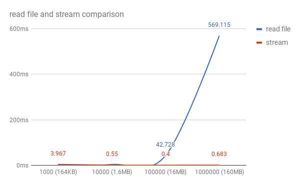

# Lesson 1. Node js вступление

- Node.js. NPM
- Базовые модули Node.js
- Работа с файловой системой. модуль fs
- Прямой доступ к файлам. переменная path
- Создание Web-сервера на Node.js
- Организация кода в Node.js
- Nodemon, мониторинг изменений в файлах Node.js
- Роутинг

## Node.js

Node.js — это опенсорсная кроссплатформенная среда выполнения для JavaScript, которая работает на серверах. С момента выпуска этой платформы в 2009 году она стала чрезвычайно популярной и в наши дни играет весьма важную роль в области веб-разработки. Если считать показателем популярности число звёзд, которые собрал некий проект на GitHub, то Node.js, у которого более 50000 звёзд, это очень и очень популярный проект.

Платформа Node.js построена на базе JavaScript движка V8 от Google, который используется в браузере Google Chrome. Данная платформа, в основном, используется для создания веб-серверов, однако сфера её применения этим не ограничивается.

Рассмотрим основные особенности Node.js.

▍Скорость

Одной из основных привлекательных особенностей Node.js является скорость. JavaScript-код, выполняемый в среде Node.js, может быть в два раза быстрее, чем код, написанный на компилируемых языках, вроде C или Java, и на порядки быстрее интерпретируемых языков наподобие Python или Ruby. Причиной подобного является неблокирующая архитектура платформы, а конкретные результаты зависят от используемых тестов производительности, но, в целом, Node.js — это очень быстрая платформа.

▍Простота

Платформа Node.js проста в освоении и использовании. На самом деле, она прямо-таки очень проста, особенно это заметно в сравнении с некоторыми другими серверными платформами.

▍JavaScript

В среде Node.js выполняется код, написанный на JavaScript. Это означает, что миллионы фронтенд-разработчиков, которые уже пользуются JavaScript в браузере, могут писать и серверный, и клиентский код на одном и том же языке программирования без необходимости изучать совершенно новый инструмент для перехода к серверной разработке.
В браузере и на сервере используются одинаковые концепции языка. Кроме того, в Node.js можно оперативно переходить на использование новых стандартов ECMAScript по мере их реализации на платформе. Для этого не нужно ждать до тех пор, пока пользователи обновят браузеры, так как Node.js — это серверная среда, которую полностью контролирует разработчик. В результате новые возможности языка оказываются доступными при установке поддерживающей их версии Node.js.

▍Движок V8

В основе Node.js, помимо других решений, лежит опенсорсный JavaScript-движок V8 от Google, применяемый в браузере Google Chrome и в других браузерах. Это означает, что Node.js пользуется наработками тысяч инженеров, которые сделали среду выполнения JavaScript Chrome невероятно быстрой и продолжают работать в направлении совершенствования V8.

▍Асинхронность

В традиционных языках программирования (C, Java, Python, PHP) все инструкции, по умолчанию, являются блокирующими, если только разработчик явным образом не позаботится об асинхронном выполнении кода. В результате если, например, в такой среде, произвести сетевой запрос для загрузки некоего JSON-кода, выполнение потока, из которого сделан запрос, будет приостановлено до тех пор, пока не завершится получение и обработка ответа.

JavaScript значительно упрощает написание асинхронного и неблокирующего кода с использованием единственного потока, функций обратного вызова (коллбэков) и подхода к разработке, основанной на событиях. Каждый раз, когда нам нужно выполнить тяжёлую операцию, мы передаём соответствующему механизму коллбэк, который будет вызван сразу после завершения этой операции. В результате, для того чтобы программа продолжила работу, ждать результатов выполнения подобных операций не нужно.

Для этого был придуман механизм [event loop](https://www.youtube.com/watch?v=8cV4ZvHXQL4)

Подобный механизм возник в браузерах. Мы не можем позволить себе ждать, скажем, окончания выполнения AJAX-запроса, не имея при этом возможности реагировать на действия пользователя, например, на щелчки по кнопкам. Для того чтобы пользователям было удобно работать с веб-страницами, всё, и загрузка данных из сети, и обработка нажатия на кнопки, должно происходить одновременно, в режиме реального времени.

Если вы создавали когда-нибудь обработчик события нажатия на кнопку, то вы уже пользовались методиками асинхронного программирования.

Асинхронные механизмы позволяют единственному Node.js-серверу одновременно обрабатывать тысячи подключений, не нагружая при этом программиста задачами по управлению потоками и по организации параллельного выполнения кода. Подобные вещи часто являются источниками ошибок.

Node.js предоставляет разработчику неблокирующие базовые механизмы ввода вывода, и, в целом, библиотеки, использующиеся в среде Node.js, написаны с использованием неблокирующих парадигм. Это делает блокирующее поведение кода скорее исключением, чем нормой.

Когда Node.js нужно выполнить операцию ввода-вывода, вроде загрузки данных из сети, доступа к базе данных или к файловой системе, вместо того, чтобы заблокировать ожиданием результатов такой операции главный поток, Node.js инициирует её выполнение и продолжает заниматься другими делами до тех пор, пока результаты выполнения этой операции не будут получены.

[Node js вступление](https://habr.com/company/ruvds/blog/422893/)

## NPM

`npm` это пакетный менеджер, который работает на node js.

С помощью npm можно устанавливать пакеты (библиотеки) локально или глобально. В локальном режиме пакеты устанавливаются в каталог node_modules родительского каталога.  

Пакеты можно ставить локально ```npm install <package-name>``` и глобально локально ```npm install <package-name> -g```

[Введение в пакетный менеджер](http://prgssr.ru/development/vvedenie-v-paketnyj-menedzher-npm-dlya-nachinayushih.html)

## Базовые модули Node.js

### Подключение скриптов: require
    
В браузере, когда мы хотим добавить еще один скрипт на страницу мы используем, как правило тег: <script></script>. В Node.JS для этой же цели мы используем специальную команду: «require» и работает она совсем, совсем по другому.

#### Пример

Файл 1
```
const module = {
    app: 'myApp' 
};

module.exports = module

```

Файл 2
```
cosnt myModule = require('./module');

console.log(myModule);
```

### Переменная «global»
Что если мы хотим все таки глобальные переменные? Например есть такие объекты как скажем «logger» или «База данных» или какой то глобальный объект приложения, которые мы хотим, чтобы были доступны явно и везде. Без всяких там экспортов, просто потому что они, такие вот важные. На самом деле в Node.JS есть концепция глобальных переменных, но вместо объекта «window», который используется в браузере, используется объект «global».  И то, что мы пишем в этот объект «global». Работает он так же как и window в браузере.


### Http модуль

В node js есть модуль HTTP. Он позволяет передавать данные по http протоколу, создавать серверы, получать запросы, отправлять ответы и записывать информацию в них.

Модуль http крайне низкоуровневый: создание сложного веб-приложения с использованием вышеприведенного фрагмента кода очень трудоемко. Именно по этой причине мы обычно выбираем фреймворки для работы над нашими проектами. Есть множество фреймворков, вот самые популярные:

- [express](https://expressjs.com/)
- [hapi](https://hapijs.com/)
- [koa](https://koajs.com/)
- [restify](http://restify.com/)

Пример

```
const server = http.createServer(requestHandler)
```
  

### FS (file system) модуль

В Node.JS, для работы с файлами существует модуль «FS» и в нем есть множество функций для самых различных операций с файлами и директориями. 

#### Базовые операции

- Read files
- Create files
- Update files
- Delete files
- Rename files

[Ссылка на документацию](https://js-node.ru/site/article?id=23)

Есть одинаковые методы как `fs.copyFile()` и `fs.copyFileSync()`

Первое просто имя, второе со словом Sync. Слово Sync означает синхронно.Если я например вызову fs.readFile(file[, options], callback), то он сначала прочитает файл полностью, а потом вызовет callback. А fs.readFileSync(file[, options]) затормозит выполнение процесса пока файл не будет прочитан. По этому, как правило синхронный вызов используют либо в консольных утилитах, либо на стадии инициализации сервера, когда такие тормоза допустимы. А асинхронный вызов, в тех случаях когда хочется, чтоб полноценно работал событийный цикл, то есть, чтоб Node.JS не ждал пока диск сработает, медленно и файл прочитается.

[Ссылка на статью с примерами](https://www.w3schools.com/nodejs/nodejs_filesystem.asp)

### path модуль

Модуль path предоставляет утилиты для работы с путями к файлам и директориям.
С помощью нее мы можем взять файл который нам нужен и передав его в другой модуль (например fs) сделать нужные операции.


Пример:
```
path.join('/foo', 'bar', 'baz/asdf', 'quux', '..')
// Возвращает: '/foo/bar/baz/asdf'

path.resolve('wwwroot', 'static_files/png/', '../gif/image.gif')
// если текущая рабочая директория /home/myself/node,
// Возвращает '/home/myself/node/wwwroot/static_files/gif/image.gif'

```

[Все методы модуля](https://js-node.ru/site/article?id=30)

#### Ключевое слово __dirname

В Node.js, `__dirname` всегда находится каталог, в котором находится текущий исполняемый script. Поэтому, если вы набрали `__dirname` в `/d1/d2/myscript.js`, значение будет `/d1/d2`.

# Node js потоки

- Синхронность, асинхронность процессов
    - синхронные асинхронные методы
    - event loop
    - promise object
    - async, await 
- Потоки в node js

## Синхронность, асинхронность процессов

В традиционной практике программирования большинство операций ввода-вывода происходит синхронно. 

Что происходит в фоновом режиме? Основной поток будет заблокирован до тех пор, пока файл не будет прочитан, а это означает, что за это время ничего другого не может быть сделано. Чтобы решить эту проблему и лучше использовать ваш CPU, вам придется управлять потоками вручную.

Если у вас больше блокирующих операций, очередь событий становится ещё хуже:


Красные полосы отображают промежутки времени, в которые процесс ожидает ответа от внешнего ресурса и блокируется, чёрные полосы показывают, когда ваш код работает, зелёные полосы отображают остальную часть приложения

Для решения этой проблемы Node.js предлагает модель асинхронного программирования.

[Асинхронное програмирование в node js](https://medium.com/devschacht/node-hero-chapter-3-cae7333c7f3d)

## Event loop

Цикл событий (Event Loop) — это то, что позволяет Node.js выполнять неблокирующие операции ввода/вывода (несмотря на то, что JavaScript является однопоточным) путем выгрузки операций в ядро системы, когда это возможно.

[Лучшее видео об event loop](https://www.youtube.com/watch?v=8cV4ZvHXQL4)

[Ссылка на презентацию по event loop](https://drive.google.com/open?id=1OBMSG1HyNa13DtI_J_csFMvk0O6S9pQK)

### Promise


В JavaScript «промисы» представляет собой конечный результат выполнения асинхронной операции. Их можно рассматривать в качестве своеобразного «заполнителя». Такой «заполнитель», по существу, является объектом, к которому мы можем привязать функции обратного вызова (колбэки).

Всего существует 3 возможных состояния для промисов:

- Pending (ожидание) означает, что асинхронная операция выполняется;
- Fulfilled (успешное выполнение) означает, что операция была выполнена успешно, а промисам было присвоено определенное значение;
- Rejected (выполнено с ошибкой) означает, что во время выполнения операции произошла ошибка.


В том случае если состояние промиса не находится в ожидании обработки (pending), то промис считается выполненным, при чем выполненным окончательно: его состояние не может меняться.


[Статья по промисам 1](https://habr.com/company/zerotech/blog/317256/)
[Статья по промисам 2](https://blog.liveedu.tv/javascript-promises/)

#### Видео по промисам

- https://www.youtube.com/watch?v=SjNmkeUpQAU
- https://www.youtube.com/watch?v=s6SH72uAn3Q

## Потоки в node js (Streams)

Поток — это концепция, которая была сначала реализована в UNIX системах для передачи данных из одной программы в другую в операциях ввода/вывода. Это позволяет каждой программе быть очень специализированной в том, что она делает — быть независимым модулем. Сочетание таких простых программ помогает в создании более сложных систем путем «объединения» их в цепочку вызовов.

Распространенная задача — парсинг файла большого объема. Например, в текстовом файле с данными логов нужно найти строку, содержащую определенный текст. Вместо того, чтобы файл полностью загрузить в память, и потом начать разбирать в нем строки в поисках нужной, мы можем его считывать небольшими порциями. Тем самым не занимаем память сверх необходимого, а лишь столько памяти, сколько нужно для буферизации считанных данных. Как только найдем требуемую запись, сразу прекратим дальнейшую работу. Или можем передать найденную запись в другой поток по цепочке, например, для преобразование в другой формат, или сохранения в другой файл.

Самое большое преимущество потоков по сравнению с одновременной загрузкой всех данных состоит в том, что входные данные могут быть бесконечными и без ограничений.

Как только поток открывается, данные передаются блоками (chunks) из своего источника в процесс, потребляющий их. Поступая из файла, каждый символ или байт считывается по одному.

Модуль stream предоставляет базовый API по работе с потоками в Node.JS. Документации Node.JS вполне достаточно, чтобы разобраться в данном вопросе, но мы попытаемся составить что-то вроде шпаргалки с пояснениями некоторых моментов.

### Виды потоков

#### Есть четыре вида потоков:

- **Readable** — поток, который предоставляет данные на чтение;
- **Writable** — поток, в который данные можно записывать;
- **Duplex** — поток, из которого можно как читать данные (Readable), так и записывать в него (Writable), при этом процесс чтения и записи просиходит независимо друго от друга;
- **Transform** — разновидность Duplex потоков, которые могут изменять данные при их записи и чтении в/из потока (чаще используется как промежуточное звено в цепочке передачи данных).


Видео для лучшего пониманию потоков
- https://www.youtube.com/watch?v=TobCwECU5Bs
- https://www.youtube.com/watch?v=GpGTYp_G9VE

## Readable stream

[Видео](https://www.youtube.com/watch?v=E3tTzx0Qoj0)

### `fs.readFile` vs `streams`

По умолчанию стандарт чтения текстовых файлов есть использование `fs.readFile(filename, “utf8")`

Преимущество в node.js для `createReadStream` заключается  в том, чтобы читать файл в кусках по 16 Кбайт за раз. Как только мы прочитаем первый фрагмент, мы получим заголовок этой строки, а затем немедленно уничтожим поток, чтобы он больше не читал фрагменты. Это позволяет нам быстро работать независимо от размера файла.

И вот сравнение для чтения в CSV разных размеров, размером от 164 КБ до 160 МБ (ось х - это строки CSV / размер файла, ось у - это время, затраченное на соответствующую функцию read.js для чтения файлов):



Как вы можете видеть, `stream` метод остается в значительной степени плоским и быстрым, тогда как метод `readFile` начинает заметно возрастать, когда мы приближаемся к размеру файла размером ~ 16 МБ.

Если вы планируете иметь дело с текстовыми файлами большего размера, чем около 10 МБ, лучше всего не использовать `readFile` и вместо этого использовать потоки.

Есть еще одна вещь, чтобы упомянуть, использование потока кажется немного более быстрым при работе с файлом 100000+ строк по сравнению с меньшими размерами файлов. 

[Статья](https://medium.com/tensult/stream-and-buffer-concepts-in-node-js-87d565e151a0)

### Writable stream

В поток на запись можно послать данные используя метод `stream.write`, но прочитать их уже не получится:

`src.pipe(writableStream)`


```
var fs = require("fs");
var data = 'Simply Easy Learning';

// Create a writable stream
var writerStream = fs.createWriteStream('output.txt');

// Write the data to stream with encoding to be utf8
writerStream.write(data,'UTF8');

// Mark the end of file
writerStream.end();

// Handle stream events --> finish, and error
writerStream.on('finish', function() {
    console.log("Write completed.");
});

writerStream.on('error', function(err){
   console.log(err.stack);
});

console.log("Program Ended");

```

[Видео по Writable stream](https://www.youtube.com/watch?v=DvlCT0N7yQI)

### Преобразование данных

Потоки хороши не только для передачи данных между различными источниками и адресатами.

Когда после открытия потока данные становятся доступны, разработчики могут преобразовывать данные, поступающие из потока, до того, как они достигнут своего адресата, например, преобразовывая все символы нижнего регистра в файле в символы верхнего регистра.

Это одна из величайших сил потоков. Как только поток открывается и вы можете прочитать данные по частям, вы можете вставить различные программы в промежутке. Этот процесс показан на рисунке ниже.

### Pipe метод

Любой поток может использовать.pipe() для соединения входов с выходами.

.pipe() это просто функция, которая берет поток на чтение src и соединяет его вывод с вводом потока на запись.

Чтобы передать данные из одного потока в другой, самый простой способ вызвать над потоками метод pipe:

```
Readable.pipe(Writable);//например, по "схеме" DataBase -> File
Readable.pipe(Transform).pipe(Writable);//DataBase -> преобразовать в JSON формат -> сохранить JSON в File
Duplex.pipe(Transform).pipe(Duplex);//прочитать из DataBase -> обработать -> записать обратно в DataBase результат
```

Последняя цепочка вызовов показывает, что реализовывать свои классы потоков лучше таким образом, чтобы каждый их них решал свою задачу.

Как видно — метод pipe возвращает экземпляр потока, который был передан в него, что и позволяет потоки объединять между собой.

Метод pipe, реализован таким образом, что он решает задачу контроля «скорости» передачи данных из одного потока в другой (превышение объема внутреннего буфера потока). Например, Writable поток работает на запись медленнее, чем их передает источник данных Readable. В этом случае передача данных «приостанавливается» до тех пор, пока Writable «не сообщит» (внутренний буфер очистится), что он готов принимать следующую порцию данных.

## Создание Web-сервера на Node.js

Вот пример создания простого сервера на nod.js

```
const http = require('http');
const port = 3000;

const requestHandler = (request, response) => {
    console.log(request.url);
    response.end('Hello Node.js Server!');
};

const server = http.createServer(requestHandler);

server.listen(port, (err) => {
    if (err) {
        return console.log('something bad happened', err)
    }
    console.log(`server is listening on ${port}`)
});

```

Теперь мы можем отправить запрос на адрес `http://localhost:3000/` и получить ответ от сервера.

[Пример простого сервера и клиента с POST запросом](https://gist.github.com/umidjons/88fa0041e6dd583491dd83662d007d2c)

## Организация кода в Node.js

#### 5 основных правил структурирования проектов
Существует множество возможных способов организации Node.js-проектов и каждый из известных методов имеет свои плюсы и минусы. Однако разработчики всегда хотят добиться одного и того же: чистоты кода и возможности легко добавлять новые функции.

[5 основных правил структурирования проектов](https://medium.com/devschacht/node-hero-chapter-7-4078fa61ece6)

[Node.js app пример](https://github.com/contentful/the-example-app.nodejs) смотрите только те файлы и папки что вам нужны

## Nodemon, мониторинг изменений в файлах Node.js

Абсолютно у всех разработчиков знакомство с nodejs начинается с того, что после каждого изменения нужно перезагружать сервер. Поэтому, в этом видео мы разберем, как сделать так, чтобы сервер перегружался автоматически.

Самый популярный вариант - это nodemon. То есть идея состоит в том, что в development окружении мы хотим, чтобы nodemon следил за файлами, которые мы меняем и просто перезапускал сервер, если эти файлы относятся к серверу.

Для установки - `npm install -g nodemon`

[Видео по nodemon](https://monsterlessons.com/project/lessons/perezagruzhaem-node-s-pomoshyu-nodemon)


